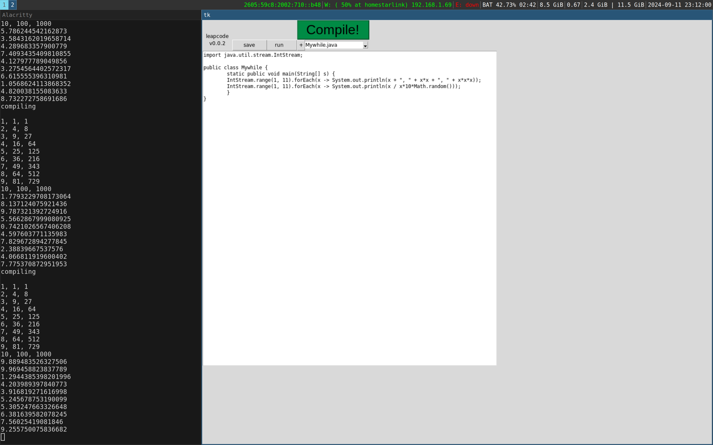

*make the leap to-*
# leapcode
next generation java IDE

# features
* text-editor like functionality
* startup splashscreen
  * **since version 0.0.3 *may result in longer loadtimes- this is due to the advanced optimizations taking place at runtime***
* Keybinds
  * Copy and paste
  * Compile, run, and save
* light and dark themes
* syntax highlighting
* *NEW* windows support ig

# coming soon
* logo

# install
requirements:
* python >= 3.0
* pip
* [sv-ttk](https://github.com/rdbende/Sun-Valley-ttk-theme)

# usage
simply run with python (>= 3.0, requires tkinter)
for those with poor sight, the compile button has
been enlarged for convenience to stand out against
**leapcode's** complex controls. **leapcode** has **platform 
specific code** that may or may not run in powershell, 
but is tested in bash shell, so should be well emulated 
in WSL. **The bin directory of your JDK should be in path.**

**NOTE: leapcode is developed for and developed on linux,**
**and has no support for proprietary nvidia drivers. When you**
**have a choice, keep open source in mind!**

# keybinds
| Cntrl+{letter} | function |
|---------------:|:--------:|
| r              | run      |
| f              | compile  |
| s              | save     |

the rest you already know
